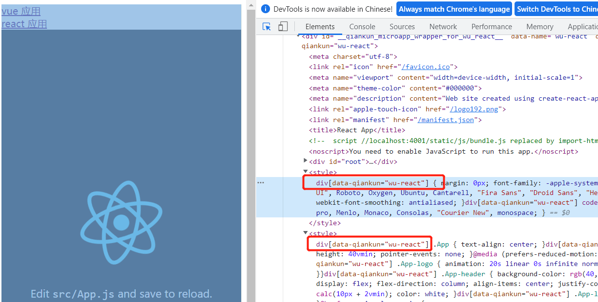

## 创建项目

- 创建以下四个项目, 基座项目需要安装react-router-dom 和 qiankun ；

**注意：如果父应用使用 browser-router， 子应用也要使用。**

```shell
create-react-app base #基座
create-react-app wu-react # react 应用
vue create wu-vue # vue3 应用
vue create vue-parcel # vue2公共组件
```

## 子应用的注册

需要在基座的入口文件内运行，如 main.js 中；

```js
// qiankun 基于 single-spa
import { registerMicroApps, start } from "qiankun";
const loader = (loading) => {
  console.log("loading。。。中");
};

registerMicroApps(
  [
    
  ],
  {
    beforeLoad() {
      console.log("加载前");
    },
    beforeMount() {
      console.log("挂载前");
    },
    afterMount() {
      console.log("挂载后");
    },
    beforeUnmount() {
      console.log("销毁前");
    },
    afterUnmount() {
      console.log("销毁后");
    },
  }
);

start();

```


## vue 应用的加载和运行

- qiankun 基座请求 vue 子应用资源时，会使用 fetch 方式，fetch  默认不允许跨域，因此在vue 子应用 webpack 配置中，子应用需要配置允许跨域；使用 umd  方式打包；

  ```js
  // vue.config.js
  module.exports = {
    publicPath: "//localhost:8081", // 保证静态资源都从 8081 端口获取
    devServer: {
      port: 8081,
      headers: {
        "Access-Control-Allow-Origin": "*",
      },
    },
    configureWebpack: {
      output: {
        libraryTarget: "umd", //使用 umd 方式打包，变量都挂载到 window 上
        library: "wu-vue", // 挂载到 window 上的变量名
      },
    },
  };
  ```

  

- 子应用应该是在 mount 时才渲染，即不能默认挂载渲染；且每次渲染的子应用都是一个全新实例，路由也是全新路由；

- 如果是在 qiankun 中渲染，window 中就会有个变量 ``__POWERED_BY_QIANKUN__`` ,可以用来作判断依据；启动后此变量会消失；

- 子应用需要向外暴露三个钩子， 者三个钩子必须要返回 promise ，使用 asnyc 函数或者 Promise 

  ```js
  export const bootstrap = async () => {
    // do something
  }
  // props 包含注册时的选项
  export const mount = (props) => Promise.resolve().then(() => {
  })
  
  export const unmount = async () => {
    // do something
  }
  ```

  

### react 应用的加载和运行

- 使用 插件 ``@rescripts/cli``  修改 create-react-app 项目的 webpack 配置。需要先安装。

  ```shell
  yarn add @rescripts/cli -D
  ```

  ```js
  // .rescriptsrc.js
  const packageName = require("./package.json").name;
  const outputCfg = {
    library: packageName,
    libraryTarget: "umd",
    publicPath: "//localhost:4001/", // 末尾的 / 不能少
  };
  
  module.exports = {
    webpack(config) {
      config.output = { ...config.output, ...outputCfg };
      return config;
    },
    devServer: (config) => {
      config.headers = {
        "Access-Control-Allow-Origin": "*", // 允许跨域
      };
      return config;
    },
  };
  ```

  如果修改端口，需要在 react 项目下新建一个 .env 文件

  ```shell
  // .env 文件
  PORT=4000
  WDS_SOCKET_PORT=4000  # 热更新的端口
  ```

  运行时要使用 rescripts 命令， 而不是 react-scripts, 如  ``react-scripts start  ``  要改成  ``rescripts start`` ;

  ```shell
   "start": "rescripts start",
   "build": "react-scripts build",
   "test": "react-scripts test",
   "eject": "react-scripts eject"
  ```

### css 隔离

> qainkun 中切换应用时会采用动态样式表；加载时添加样式，卸载时删除样式，因此做到各个子应用之间的 css 隔离；但是存在主子应用之间的样式冲突问题；

- 解决方法一，通过 BEM 规范命名的方式来解决，但是此方式较弱；

- 解决方式二， 使用 css-module 方式来解决，此方式较好；具体实现，在注册好子应用后，在 start 方法中添加一个配置，加个配置如下；此方案并不是最好的；

  ```js
  start({
    sandbox: {
      experimentalStyleIsolation: true, // 实验性的样式解决方案
    },
  });
  ```

  得到效果如下，会在每个应用的样式上加个前缀进行隔离

  

- 解决方式三： shadowDOM, 即影子 dom 