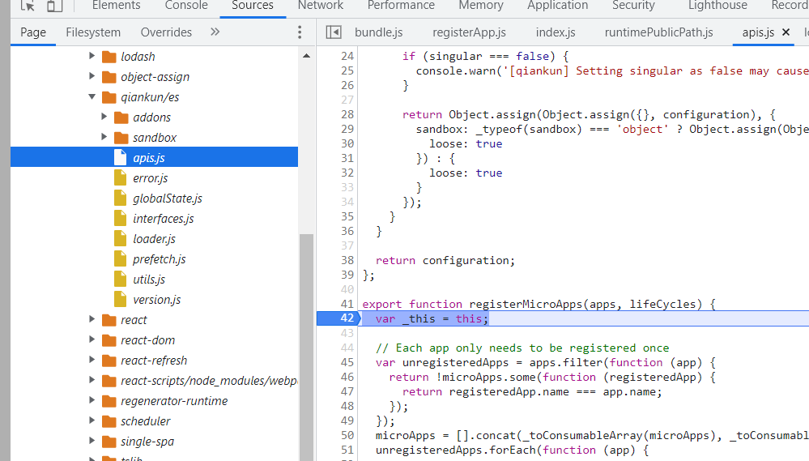
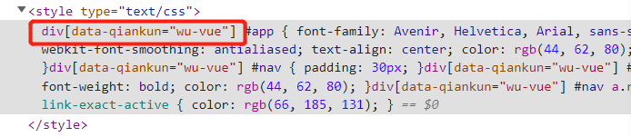
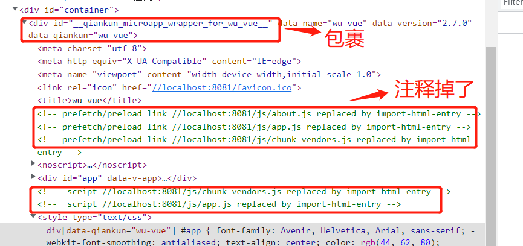

## 创建项目

- 创建以下四个项目, 基座项目需要安装react-router-dom 和 qiankun ；

**注意：如果父应用使用 browser-router， 子应用也要使用。**

```shell
create-react-app base #基座
create-react-app wu-react # react 应用
vue create wu-vue # vue3 应用
vue create vue-parcel # vue2公共组件
```

## 子应用的注册

需要在基座的入口文件内运行，如 main.js 中；

```js
// qiankun 基于 single-spa
import { registerMicroApps, start } from "qiankun";
const loader = (loading) => {
  console.log("loading。。。中");
};

registerMicroApps(
  [
    
  ],
  {
    beforeLoad() {
      console.log("加载前");
    },
    beforeMount() {
      console.log("挂载前");
    },
    afterMount() {
      console.log("挂载后");
    },
    beforeUnmount() {
      console.log("销毁前");
    },
    afterUnmount() {
      console.log("销毁后");
    },
  }
);

start();

```


## vue 应用的加载和运行

- qiankun 基座请求 vue 子应用资源时，会使用 fetch 方式，fetch  默认不允许跨域，因此在vue 子应用 webpack 配置中，子应用需要配置允许跨域；使用 umd  方式打包；

  ```js
  // vue.config.js
  module.exports = {
    publicPath: "//localhost:8081", // 保证静态资源都从 8081 端口获取
    devServer: {
      port: 8081,
      headers: {
        "Access-Control-Allow-Origin": "*",
      },
    },
    configureWebpack: {
      output: {
        libraryTarget: "umd", //使用 umd 方式打包，变量都挂载到 window 上
        library: "wu-vue", // 挂载到 window 上的变量名
      },
    },
  };
  ```

  

- 子应用应该是在 mount 时才渲染，即不能默认挂载渲染；且每次渲染的子应用都是一个全新实例，路由也是全新路由；

- 如果是在 qiankun 中渲染，window 中就会有个变量 ``__POWERED_BY_QIANKUN__`` ,可以用来作判断依据；启动后此变量会消失；

- 子应用需要向外暴露三个钩子， 者三个钩子必须要返回 promise ，使用 asnyc 函数或者 Promise 

  ```js
  export const bootstrap = async () => {
    // do something
  }
  // props 包含注册时的选项
  export const mount = (props) => Promise.resolve().then(() => {
  })
  
  export const unmount = async () => {
    // do something
  }
  ```

  

### react 应用的加载和运行

- 使用 插件 ``@rescripts/cli``  修改 create-react-app 项目的 webpack 配置。需要先安装。

  ```shell
  yarn add @rescripts/cli -D
  ```

  ```js
  // .rescriptsrc.js
  const packageName = require("./package.json").name;
  const outputCfg = {
    library: packageName,
    libraryTarget: "umd",
    publicPath: "//localhost:4001/", // 末尾的 / 不能少
  };
  
  module.exports = {
    webpack(config) {
      config.output = { ...config.output, ...outputCfg };
      return config;
    },
    devServer: (config) => {
      config.headers = {
        "Access-Control-Allow-Origin": "*", // 允许跨域
      };
      return config;
    },
  };
  ```

  如果修改端口，需要在 react 项目下新建一个 .env 文件

  ```shell
  // .env 文件
  PORT=4000
  WDS_SOCKET_PORT=4000  # 热更新的端口
  ```

  运行时要使用 rescripts 命令， 而不是 react-scripts, 如  ``react-scripts start  ``  要改成  ``rescripts start`` ;

  ```shell
   "start": "rescripts start",
   "build": "react-scripts build",
   "test": "react-scripts test",
   "eject": "react-scripts eject"
  ```

### css 隔离

> qainkun 中切换应用时会采用动态样式表；加载时添加样式，卸载时删除样式，因此做到各个子应用之间的 css 隔离；但是存在主子应用之间的样式冲突问题；

- 解决方法一，通过 BEM 规范命名的方式来解决，但是此方式较弱；

- 解决方式二， 使用 css-module 方式来解决，此方式较好；具体实现，在注册好子应用后，在 start 方法中添加一个配置，加个配置如下；此方案并不是最好的；

  ```js
  start({
    sandbox: {
      experimentalStyleIsolation: true, // 实验性的样式解决方案
    },
  });
  ```

  得到效果如下，会在每个应用的样式上加个前缀进行隔离

  

- 解决方式三： shadowDOM, 即影子 dom 


### js 沙箱的实现


## qiankun  源码剖析

### 1. 三个方法

- #### registerMicroApps(apps, lifeCycles),  

  参数为注册的应用， 生命周期；

  1. 每个应用只注册一次，先获取到没有注册的应用；

  2. 然后将已经注册的和没有注册的应用缓存起来，以便在未来的某个时候作对比；

  3. 对需要注册的应用，遍历注册，使用 single-spa 的 registerApplication 方法；

  4. 打断点，在浏览器中控制台左侧，找到qiankun模块，进行断点。

     

  5. 加载 app 的核心方法 **loadApp**，参数为 用户基本配置，处理后的配置，包含沙箱等，生命周期；使用的是 第三方包 import-html-entry ;

     ```js
     loadApp({ name, props, ...appConfig }, frameworkConfiguration, lifeCycles)
     ```

     1. 先会在加载到的子应用模板外加个 div 包起来， 如下：

     ```html
     <div id="__qiankun_microapp_wrapper_for_wu_vue__" data-name="wu-vue" data-version="2.7.0" data-qiankun="wu-vue">
       vue应用html内容
     </div>
     ```

     2. 如果 sandbox.strictStyleIsolation 为 true ,且支持 shadowDom （不支持时会忽略此属性值）, 就会采用 shadowDom 方式；

     3. 如果使用采用 scopedCSS的方式，就给应用每个 style 标签都加上父级 div 前缀作为隔离；包括 link css 标签也转成 style 标签；

        

        

     4. loadApp 方法的核心。

        调用 importHTML 方法，使用 fetch(url).then() 的方式来获取结果，是一个对象, 先转成 html 字符串，会将 html 中的 链接都注释掉；execScripts 方法会执行脚本 js， 会传入一个 proxy 来代理 window ；

        

        

        ```js
        // url 为 "//localhost:8081"形式；
        fetch(url).then(function (response) {
            return readResAsString(response, autoDecodeResponse);
        }).then(function (html) {// 得到 html }
        ```

        制作沙箱，如果 loose 为 true 就用快照方式；如果支持 Proxy ，就用 代理方式；提供两个方法，沙箱挂载和卸载，mountSandbox 和 unmountSanbox ;

        ```js
        export default function getAddOns<T extends ObjectType>(global: Window, publicPath: string): FrameworkLifeCycles<T> {
          return mergeWith({}, getEngineFlagAddon(global), getRuntimePublicPathAddOn(global, publicPath), (v1, v2) =>
            concat(v1 ?? [], v2 ?? []),
          );
        }
        
        // getEngineFlagAddon 方法
        export default function getAddOn(global: Window): FrameworkLifeCycles<any> {
          return {
            async beforeLoad() {
              // eslint-disable-next-line no-param-reassign
              global.__POWERED_BY_QIANKUN__ = true;
            },
        
            async beforeMount() {
              // eslint-disable-next-line no-param-reassign
              global.__POWERED_BY_QIANKUN__ = true;
            },
        
            async beforeUnmount() {
              // eslint-disable-next-line no-param-reassign
              delete global.__POWERED_BY_QIANKUN__;
            },
          };
        }
        
        
        // getRuntimePublicPathAddOn 方法
        export default function getAddOn(global: Window, publicPath = '/'): FrameworkLifeCycles<any> {
          let hasMountedOnce = false;
        
          return {
            async beforeLoad() {
              // eslint-disable-next-line no-param-reassign
              global.__INJECTED_PUBLIC_PATH_BY_QIANKUN__ = publicPath;
            },
        
            async beforeMount() {
              if (hasMountedOnce) {
                // eslint-disable-next-line no-param-reassign
                global.__INJECTED_PUBLIC_PATH_BY_QIANKUN__ = publicPath;
              }
            },
        
            async beforeUnmount() {
              if (rawPublicPath === undefined) {
                // eslint-disable-next-line no-param-reassign
                delete global.__INJECTED_PUBLIC_PATH_BY_QIANKUN__;
              } else {
                // eslint-disable-next-line no-param-reassign
                global.__INJECTED_PUBLIC_PATH_BY_QIANKUN__ = rawPublicPath;
              }
        
              hasMountedOnce = true;
            },
          };
        }
        
        ```

        先将生命周期钩子执行完毕， 然后执行用户脚本，将 global 作为新的 window ；获取用户的四个接入协议钩子

        - execHooksChain  方法会将 钩子都转成链式依次执行，每次指定需要运行的即可；

        ```js
        // execHooksChain 方法
        function execHooksChain<T extends ObjectType>(
          hooks: Array<LifeCycleFn<T>>,
          app: LoadableApp<T>,
          global = window,
        ): Promise<any> {
          if (hooks.length) {
            return hooks.reduce((chain, hook) => chain.then(() => hook(app, global)), Promise.resolve());
          }
        
          return Promise.resolve();
        }
        
        // 使用
        await execHooksChain(toArray(beforeLoad), app, global);
        ```

        - 

- #### start(opts)

  > 三个默认开启：预加载，单例，沙箱

  1. 默认开启预抓取，第一个应用加载完毕后，默认会加载其他应用，可以自行配置是否开启；

     监听当第一个应用加载后，在空闲时间就对所有未加载过的 app 预加载，当断网或者慢网情况下，就不加载。使用 importEntry 来代替 systemJS ,其内部使用的是 第三方包 import-html-entry， 使用 fetch 方式 ；

     ```js
     // 判断是否慢网
     const isSlowNetwork = navigator.connection
       ? navigator.connection.saveData ||
         (navigator.connection.type !== 'wifi' &&
           navigator.connection.type !== 'ethernet' &&
           /([23])g/.test(navigator.connection.effectiveType))
       : false;
     // 加载
     function prefetch(entry: Entry, opts?: ImportEntryOpts): void {
       if (!navigator.onLine || isSlowNetwork) {
         // Don't prefetch if in a slow network or offline
         return;
       }
     
       requestIdleCallback(async () => {
         const { getExternalScripts, getExternalStyleSheets } = await importEntry(entry, opts);
         // 在浏览器空闲时执行加载任务
         requestIdleCallback(getExternalStyleSheets);
         requestIdleCallback(getExternalScripts);
       });
     }
     ```

     

  2. 默认启用单例模式，同时只有一个应用在使用，

  3. 默认会将开启 js 快照沙箱。js 沙箱的两种模式：快照沙箱 和  proxy 方案。

     - 快照沙箱：在加载第一个应用之前，提前记录 window 上有哪些属性，作为快照保存起来，每次加载应用时，将不属于快照上的属性添加到window上；当应用卸载时，用快照将 window  还原回来；本质是加载与卸载时对window 属性的对比；此方案不能适应多个应用同时加载的场景。loose 为 true 就是使用 快照方式；

     - proxy 方案。多个应用同时加载时，给每个应用 加个盒子，此盒子就是 proxy ，用这个盒子来代理 window ，当应用访问 window 对象时，实际访问的是 这个代理，而不会对外界真正的 window 造成影响。方式如下：

       ```js
       // 将proxy 作为window使用
       (function(window){
           // 真实代码运行
       })(proxy) 
       ```

       

     qiankun 中的代码如下：

     ```js
     const autoDowngradeForLowVersionBrowser = (configuration: FrameworkConfiguration): FrameworkConfiguration => {
       const { sandbox, singular } = configuration;
       if (sandbox) { // 如果用户配置了沙箱，包括css沙箱， js 沙箱。
         if (!window.Proxy) { // 没有采用 proxy 的方式
           console.warn('[qiankun] Miss window.Proxy, proxySandbox will degenerate into snapshotSandbox');
     
           if (singular === false) {
             console.warn(
               '[qiankun] Setting singular as false may cause unexpected behavior while your browser not support window.Proxy',
             );
           }
     
           // 不支持 proxy 的会将 loose 置为 true, 此时就用 快照 方式
           return { ...configuration, sandbox: typeof sandbox === 'object' ? { ...sandbox, loose: true } : { loose: true } };
         }
       }
     
       return configuration;
     };
     ```

  4. qiankun 整体上做了两件事： 预加载，沙箱。

     

- initGlobalState 方法是用来全局通信的，内置了一个发布订阅系统；