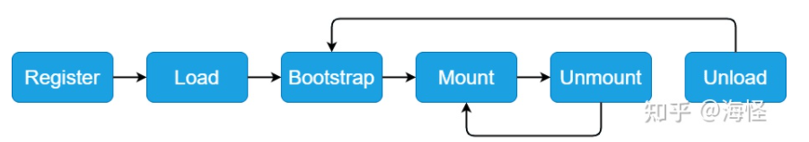

# 微前端解决的问题

1. 用不同技术栈开发同一个应用；

2. 独立开发，独立部署；
3. 对旧的项目可以增量迁移，减少推倒重构；

# 实现

1. 将应用划分成若干个子应用，将子应用打包成一个个的模块。路径切换时加载不同子应用，而子应用技术栈独立。
2. 子应用需要暴露固定的钩子， bootstrap， mount，unmount。

# 微前端历史

- 2018年 Single-SPA诞生了， `single-spa`是一个用于前端微服务化的`JavaScript`前端解决方案 (本身**没有处理样式隔离，`js`执行隔离**) 实现了路由劫持和应用加载，需要systemJs 配合。

- 2019年 `qiankun`基于Single-SPA, 提供了更加开箱即用的 `API` （`single-spa` + `sandbox` + `import-html-entry`） 做到了，技术栈无关、并且接入简单（像i`frame`一样简单），模块加载处理不是很好，通信不是很方便，可以将多个应用接入到父应用中；
- 2020年 EMP 基于 module Federation ，接入成本低，解决第三方包问题；

> 总结：子应用可以独立构建，运行时动态加载,主子应用完全解耦，技术栈无关，靠的是协议接入（qiankun 子应用必须导出 bootstrap、mount、unmount方法）

**这不是`iframe`吗？**

- 如果使用`iframe`，`iframe`中的子应用切换路由时用户刷新页面就尴尬了。

**应用通信**:

- 基于URL来进行数据传递，但是传递消息能力弱
- 基于`CustomEvent`实现通信
- 基于props主子应用间通信
- 使用全局变量、`Redux`进行通信

**公共依赖**:

- `CDN` - externals
- `webpack`联邦模块


# SystemJS

一个通用的模块加载器，能在浏览器上动态加载模块。微前端的核心就是加载微应用，再将应用打包成模块，再在浏览器中通过 systemjs 来加载模块；single-spa 需要依赖此加载器。

- Chrome 89中支持的新特性 Import Map,  让 script 标签可以支持  type =“importmap”

```html
<script type="importmap">
{
  "imports": {
    "moment": "/node_modules/moment/src/moment.js",
    "lodash": "/node_modules/lodash-es/lodash.js"
  }
}
</script>
```

- 使用 systemJ是后，可以支持新属性 type="systemjs-importmap"

  ```js
   <script type="systemjs-importmap">
        {
          "imports": {
          ""
            "react": "https://cdn.bootcdn.net/ajax/libs/react/17.0.2/umd/react.development.min.js",
            "react-dom": "https://cdn.bootcdn.net/ajax/libs/react-dom/17.0.2/umd/react-dom.production.min.js"
          }
        }
      </script>
  ```

  

## single-spa 实战

#### 1、搭建 react 项目

```shell
yarn init -y

yarn add webpack webpack-cli webpack-dev-server babel-loader @babel/core @babel/preset-env @babel/preset-react html-webpack-plugin -D

yarn add react react-dom -S
```


### webpack 以 syetemjs 方式打包

- syetemjs ： 浏览器通用模块加载器；

- 打包命令：

```json
 "build": "webpack --env production"
```

- 打包关键配置：

```js
// 生产时遵循 system 模块规范来打包， ”“ 会打包成自执行函数
output.libraryTarget =  env.production ? "system" : "",
// 生产时忽略打包，对 react 和 react-dom 使用 cdn 方式加载，不参与打包    
externals: env.production ? ["react", "react-dom"] : [], 
```

- 打包结果使用

  > 当react和react-dom加载完毕后，才会加载 index.js。
  >
  > 

  ```html
  <!DOCTYPE html>
  <html lang="en">
    <head>
      <meta charset="UTF-8" />
      <title>Title</title>
    </head>
    <body>
      <script type="systemjs-importmap">
        {
          "imports": {
            "react": "https://cdn.bootcdn.net/ajax/libs/react/17.0.2/umd/react.development.min.js",
            "react-dom": "https://cdn.bootcdn.net/ajax/libs/react-dom/17.0.2/umd/react-dom.production.min.js"
          }
        }
      </script>
      <div id="root"></div>
      <script src="https://cdn.bootcdn.net/ajax/libs/systemjs/6.12.1/system.js"></script>
      <script>
        // 引入 index.js 前，需要先加载 react 和 react-dom 两个模块
        System.import("./index.js");
      </script>
    </body>
  </html>
  
  ```

### systemjs 原理


# single-spa

> Single-spa 是一个将多个单页面应用聚合为一个整体应用的 JavaScript 微前端框架。
>
> 一个微前端的DOM不能够被其他微前端触及，

**single-spa 仅仅是一个子应用生命周期的调度者。**single-spa 为应用定义了 boostrap, load, mount, unmount 四个生命周期回调：



#### 一、微前端类型

在single-spa中，有以下三种微前端类型：

1. [single-spa applications](https://zh-hans.single-spa.js.org/docs/building-applications):为一组特定路由渲染组件的微前端。不同路由地址对应的不同应用；
2. [single-spa parcels](https://zh-hans.single-spa.js.org/docs/parcels-overview): 不受路由控制，渲染组件的微前端。一般是公共组件，可以在不同 应用中使用。
3. [utility modules](https://zh-hans.single-spa.js.org/docs/recommended-setup#utility-modules-styleguide-api-etc): 非渲染组件，用于暴露共享javascript逻辑的微前端。一般是公共方法；
4. single-spa root config ： 根应用；

#### 二、实战搭建

- 安装 single-spa 脚手架： 

```shell
yarn add create-single-spa -g
```

- 创建基座项目

  > 选择 single-spa root config 生成根应用；不使用其自带的 Layout Engine ；

  ```shell
  create-single-spa base
  ```

- 创建 react 应用, 创建 vue 应用

  > 选择 application， 选择 react / vue ，react 项目命名为 react-app , vue 项目不需要命名； vue3 暂时不支持 externals ，可以选 vue3。

  ```shell
  create-single-spa react-app
  create-single-spa vue-app
  ```

- 启动根应用， 打开 127.0.0.1:9000

  ```shell
  cd base  # 先进入根应用
  yarn start 
  ```

  

#### 三、应用注册加载

#### 3.1 注册

> 当匹配的路由是 / 时，就加载 此根应用，加载完毕后应用会向外暴露三个钩子： bootstrap,  mount;  unmount ；

路径匹配不能精准匹配， /vue3 也会匹配到 / ， 因此要用别的方法来是实现精准匹配；

```js
// xx-root-config.js
import { registerApplication, start } from "single-spa";

// 注册基座主应用
registerApplication({
  name: "@single-spa/welcome",
  app: () =>
    System.import(
      "https://unpkg.com/single-spa-welcome/dist/single-spa-welcome.js"
    ),
  // activeWhen: ["/"], // 以 / 开头的就能匹配上， 因此不能精准匹配
  activeWhen: (location) => location.pathname === "/",
});

// 注册 vue3 应用
registerApplication({
  name: "@wu/vue3-app",
  app: () => System.import("@wu/vue3-app"),
  // 以 /vue3 开头的就能匹配上, 此处为子应用路由的的基本路径前缀, 需要在 vue 项目的路由作为 baseUrl 配好
  activeWhen: ["/vue3"],
});

// 启动应用
start({
  urlRerouteOnly: true,
});
```

> 基座中第三方包的 cdn 加载 和 子应用的引入加载

```ejs
// 第三方包
<script type="systemjs-importmap">
    {
      "imports": {
        "single-spa": "https://cdn.jsdelivr.net/npm/single-spa@5.9.0/lib/system/single-spa.min.js",
        "react": "https://cdn.bootcdn.net/ajax/libs/react/17.0.2/umd/react.development.js",
        "react-dom": "https://cdn.bootcdn.net/ajax/libs/react-dom/17.0.2/umd/react-dom.development.min.js",
      }
    }
  </script>

// 子应用
<script type="systemjs-importmap">
    {
      "imports": {
        "@wu/root-config": "//localhost:9000/wu-root-config.js",
        "@wu/vue3-app": "//localhost:8081/js/app.js",
        "@wu/react-app": "//localhost:4000/js/wu-react-app.js",
      }
    }
  </script>
```


#### 3.2 应用加载

> 除 vue 项目外，每个项目下的 webpack 配置中有个配置 orgName 和  projectName，当前应用被其他应用使用时， 需要用 System.import(@orgName/projectName)  方式来加载，如：orgName为 wu，projectName    为  root-config ;
>
> ```js
> # 加载根应用
> System.import('@wu/root-config');
> ```

- 从根应用出发，iudex.js 中会根据加载根应用的 入口 wu-root-config.js； 然后此入口中再根据逻辑加载其其他子应用；

  ```JS
  System.import('@wu/root-config');
  ```

- 每个应用需要暴露出 三个钩子， bootstrap ， mount， unmount；vue 应用hi用一个插件 vue-cli-single-spa-plugin 将 入口文件 main.js 改写；每个应用都可以独立运行；

- vue 应用的加载路由需要加前缀，此前缀与注册时的基本路径相同；

  ```js
  // router.js
  const router = createRouter({
    // history: createWebHistory(process.env.BASE_URL),
    history: createWebHistory('vue3'),
    routes,
  });
  
  ```


#### 3.3 应用通信

- 可以在注册时传个属性 customProps ; 子应用会接收到其中的属性， 不包含 customProps  本身。

  ```js
  // 注册 vue 应用
  registerApplication({
    name: "@wu/vue3-app",
    // 此处会取找 importsmap 中的 key,因此要一致
    app: () => System.import("@wu/vue3-app"),
    // 以 /vue3 开头的就能匹配上, 此处为子应用路由的的基本路径前缀, 需要在 vue 项目的路由作为 baseUrl 配好
    activeWhen: ["/vue3"],
    customProps: {
      // 自定义 props，从子应用的 bootstrap, mount, unmount 回调可以拿到
      info: {
        authToken: "xc67f6as87f7s9d",
      },
    },
  });
  ```

- vue 子应用中接收

  对于 vue 应用， 首先会在 main.js 中接收到，传过来的数据会添加到props 里，如上， vue2 中可以直接使用 this.info 获取到；vue3中 在 props.info 中也能获取到。然S后需要传给 APP.vue

  ```js
  // main.js
  const vueLifecycles = singleSpaVue({
    createApp,
    appOptions: {
      render() {
        return h(App, {
          info: this.info,
        });
      },
    },
    handleInstance(app) {
      app.use(router);
      app.use(store);
    },
  });
  ```

>  在 app.vue 中以 props 的形式接收 info 

```vue
props: {
    info: Object,
    default: () => ({}),
},
```


